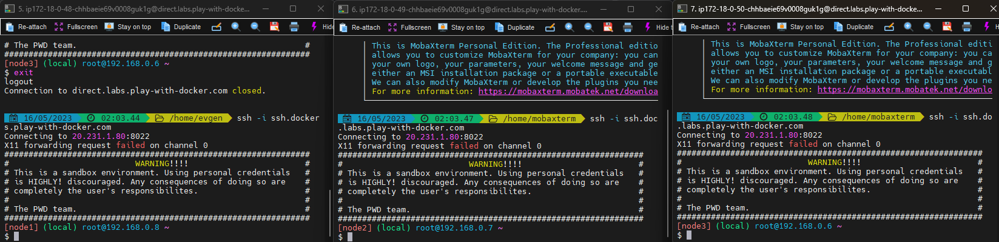
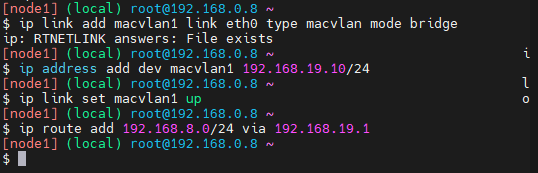
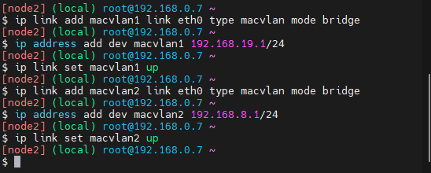
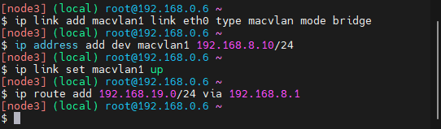
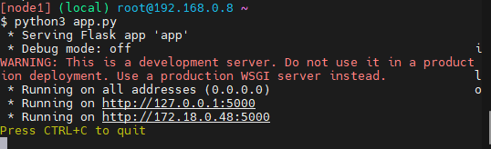
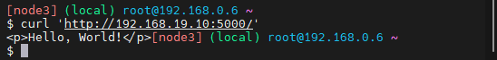
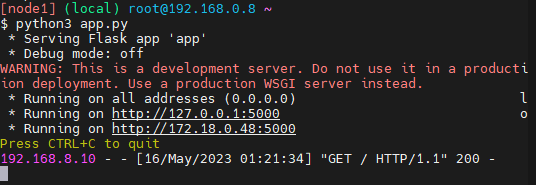
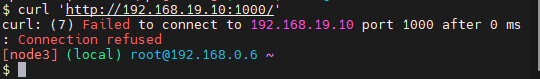

# Linux Задание 1
Cоздадим 3 виртуальные машины Play with docker и присоединим их к локальному терминалу по SSh:

## Настройка виртуальных машин
### Linux A

### Linux B

### Linux C

### Веб-сервер Linux A 

### Веб-клиент Linux С 

## Проверка 
Что бы проверить работу адаптера отправляем cyrl запрос от веб-клиента к веб-серверу. В результате, мы увидим, что запрос успешно дошел. 

Если мы поменяем порт на отличный от 5000, то запросы не смогут проходит через наш шлюз.

## Bash скрипт
Запустим bash скрипт для каждой виртуальной машины, который повторяет действия сделанные вручную. Для этого создадим заново 3 виртуалки и в результате сurl клиента принимает ответ от сервера из разных подсетей.
После запуска [LinuxA.sh](configs/LinuxA.sh) 

